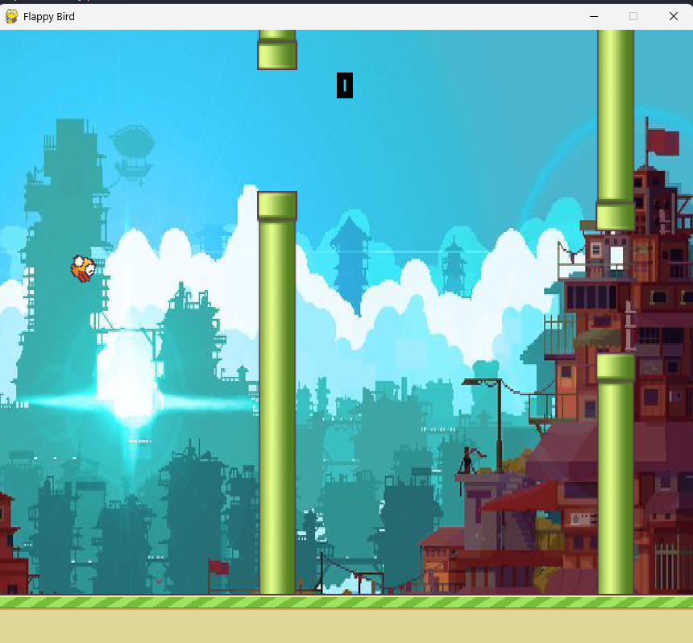

# Portfolio
---

## Projects

### Flappy Bird Clone

Developed a clone of the classic Flappy Bird game using Python and the Pygame library. Implemented game physics, collision detection, and a scoring system to mimic original gameplay. Designed game assets and managed sound effects for an immersive user experience.

 

 

---
### Online Clothing Store

Built a fully functional e-commerce website for an online clothing store using PHP and MySQL. Developed features for product management, user authentication, and a shopping cart system. Designed a responsive frontend with HTML and CSS to ensure cross-device compatibility.

 

 

---
### SSB 1.0 (Full-Stack Web App)

Developed a full-stack web application (SSB 1.0) using the MERN stack to streamline internal workflows. Integrated RESTful APIs for efficient data communication between the React frontend and Node.js backend. Utilized MongoDB for scalable data storage and implemented JWT for secure user authorization.

 

 

---
## Experience & Education

### Sai Gon University
**Software Engineering** | *June 2026*  
**Current GPA:** 2.85/4.0  
**Coursework:** Object-Oriented Programming, Data Structures & Algorithms, Embedded Systems, Discrete Math, Linear Algebra, Calculus, Physics, Probability & Statistics.

### Academic Research
**Software Engineering & Computer Science** | *2023 - Present*  
Conducted research on various topics in software engineering and computer science.

---
## Skills

- **Languages:** C/C++, Python, Java, JavaScript/TypeScript, HTML/CSS, LaTeX
- **Tools:** Git/GitHub, VS Code, Netbeans, Postman, Docker Desktop

---
## Hobbies

- **Mechanical Keyboards:** Building and customizing mechanical keyboards, including soldering, lubing switches, and configuring firmware (QMK/VIA) to enhance typing efficiency.

---

© 2024 Hồ Quốc Đạt. Powered by Jekyll and the Minimal Theme.

